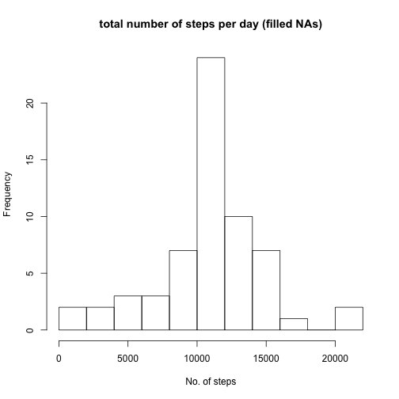

## Loading and preprocessing the data


```r
df <- read.csv(unz("activity.zip", "activity.csv"), colClasses=c(NA, "Date",NA))
```


## What is mean total number of steps taken per day?

```r
df1 <- with (df, tapply(steps, date, sum), na.rm=TRUE)
hist(df1, breaks = 10, main = "total number of steps per day", xlab ="No. of steps")
```


```r
mean(df1, na.rm = TRUE)
```

```
## [1] 10766.19
```

```r
median(df1, na.rm = TRUE)
```

```
## [1] 10765
```


## What is the average daily activity pattern?

```r
df2  <- aggregate(.~interval, data=df, mean)
plot(df2$interval, df2$steps, xlab = "Interval",    ylab ="Mean steps" , type = "l"   )  
int_max <- df2[which.max(df2$steps),]$interval
abline(v = int_max, col = "blue")
```


 
The maximum number of steps occurs on average at interval 835

## Imputing missing values

```r
n_na <- nrow(df[!complete.cases(df), ])
```

the total number of missing values in the dataset is 2304

In the following we will fill all of the missing values in the dataset using, for each interval that has NA step, the mean for that 5-minute interval.
We create df_filled, a new dataset that is equal to the original dataset but with the missing data filled in.


```r
df_filled <- df
for (i in 1:length(df_filled$steps)){
     if (is.na(df_filled$steps[i])){ 
          df_filled$steps[i] <- df2$steps[match(df_filled$interval[i], df2$interval)]  
     }
}

n_na_filled <- nrow(df_filled[!complete.cases(df_filled), ])
```
the total number of missing values in the df_filled dataset is 0

THe following picture is the histogram of the total number of steps taken each day and the mean and median total number of steps taken per day, calculated using df_filled 

```r
df_filled1 <- with (df_filled, tapply(steps, date, sum))
hist(df_filled1, breaks = 10, main = "total number of steps per day (filled NAs)", xlab ="No. of steps")
```



```r
mean(df_filled1)
```

```
## [1] 10766.19
```

```r
median(df_filled1)
```

```
## [1] 10766.19
```

Comparing the original dataset (df) with the dataset with filled NA values (df_filled) we have: 
The two histograms are identical, except for the latter, which has more days in the step range 10000-12000.
The mean does not change, whereas the median increases in the latter data set.


## Are there differences in activity patterns between weekdays and weekends?

Here we add a column 'dow' (day of the week) to the dataset and a new factor variable 
with two levels – “weekday” and “weekend” indicating whether a given date is a weekday or weekend day.


```r
df_filled$dow <- weekdays(df_filled$date, abbr = TRUE)
for (i in 1:nrow(df_filled) ) {
     if (df_filled$dow[i] == "Sat" || df_filled$dow[i] == "Sun"){ 
          df_filled$daytype[i] <-  "weekend" 
     } else {
         df_filled$daytype[i] <-  "weekday" 
     }
}

df_filled$daytype <- as.factor(df_filled$daytype)
```

Calculate average number of steps taken, averaged across all weekday days or weekend days:


```r
df_weekday <- subset(df_filled, daytype == "weekday")
df_weekday_mean <- aggregate(df_weekday$steps, list(df_weekday$interval), mean)
colnames(df_weekday_mean) <- c("interval", "steps")
df_weekday_mean$daytype = as.factor("weekday")

df_weekend <- subset(df_filled, daytype == "weekend")
df_weekend_mean <- aggregate(df_weekend$steps, list(df_weekend$interval), mean)
colnames(df_weekend_mean) <- c("interval", "steps")
df_weekend_mean$daytype = as.factor("weekend")

df_all_mean  <- rbind(df_weekday_mean, df_weekend_mean)
```


panel plot containing a time series plot of the 5-minute interval (x-axis) and the average number of steps taken, averaged across all weekday days or weekend days (y-axis):


```r
library(ggplot2)
ggplot() + geom_line(data = df_all_mean, aes(x = interval, y = steps))  +  facet_grid(daytype ~ .)
```


 
    
    
    

